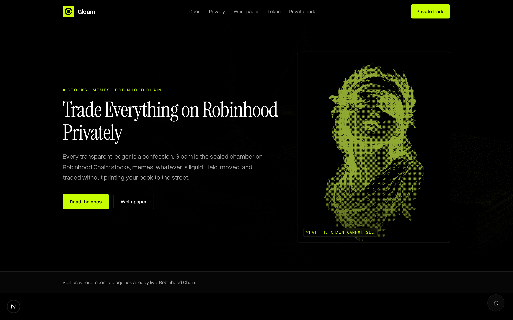
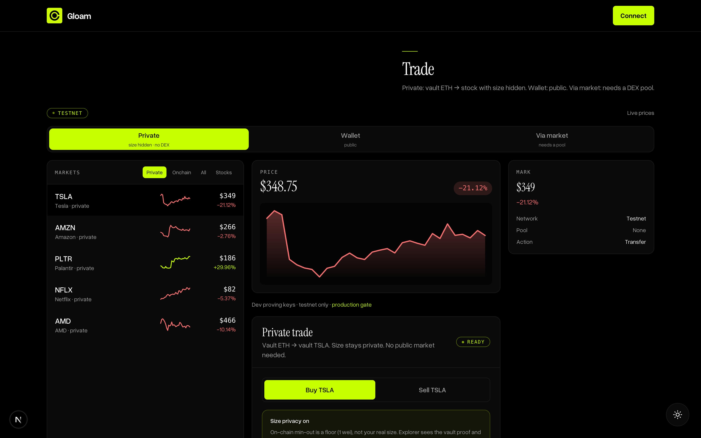
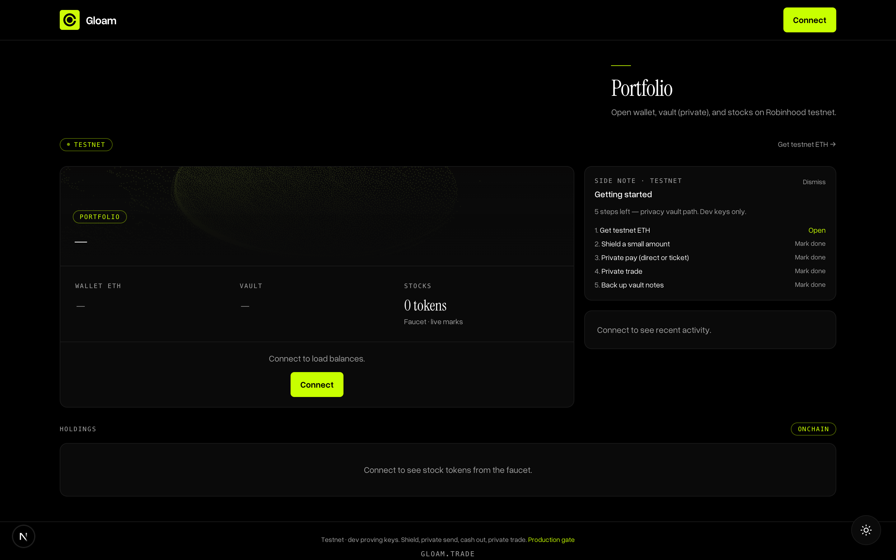

<div align="center">

# Gloam

### Private execution for Robinhood Chain. The privacy layer apps and agents build on.

[gloam.trade](https://gloam.trade) · [Testnet app](https://gloam.trade/app) · [Docs](https://gloam.trade/docs) · [Whitepaper](https://gloam.trade/whitepaper) · [@gloamtrade](https://x.com/gloamtrade)

**Robinhood Chain** · testnet `46630` · testnet only, real privacy only



</div>

---

Robinhood Chain puts tokenized stocks and crypto on the same rails. Every move on it is public: your holdings, your size, your timing. Gloam is the sealed chamber. Shield a balance, move it privately, and trade it without printing your book to the street. Not a dark theme on a public DEX, a private-execution primitive other apps and AI agents plug into.

## The layer

One private path, exposed three ways. The vault app is the reference implementation, not the whole product.

| Surface | What it is | Package |
| --- | --- | --- |
| **SDK** | Drop shielded balances, private transfers, and private trades into any Robinhood Chain app. Unsigned intents + client proving. | [`@gloam/sdk`](./packages/sdk) |
| **Agents** | An MCP server so an AI agent can shield and privately trade end to end, under policy. | [`@gloam/mcp`](./mcp) |
| **Vault** | The live testnet app that proves the whole path works. | [`app/`](./app) |

All three share one core: the Poseidon note scheme, a depth-20 Merkle tree, circom witness builders, and the canonical intent shape (`shield`, `privateSend`, `unshield`, `privateTrade`).

## Private trade, size hidden

Vault ETH into vault TSLA with the amount off the open book. On-chain min-out is a 1-wei floor, so the explorer sees a proof and an asset pair, never your size.



## Works today (testnet, real ZK proofs)

| Path | What you can do |
| --- | --- |
| **Shield** | Deposit ETH + faucet stock tokens into the live sealed vault |
| **Private send** | Send inside the vault to a receive tag; on-chain encrypted memo inbox (`GloamPayMemo`) |
| **Cash out** | Unshield to a public balance with a real browser-generated Groth16 proof |
| **Private trade** | `sealedSwap` with size privacy on by default |

Every private action is proof-gated on-chain. No mock fills, no theatrical privacy. If a path cannot be private yet, it waits.



## Robinhood Chain native

Robinhood Chain is an **Arbitrum Orbit L2** on the Nitro stack (mainnet live since July 2026), ETH gas, Ethereum blob DA. Gloam is built for what the chain actually ships:

- **Chainlink oracles from block zero.** RH Chain prices ~95 tokenized equities on-chain via Chainlink Data Feeds. Gloam binds sealed-trade rates to `AggregatorV3Interface.latestRoundData()` with staleness, sequencer-uptime, and `oraclePaused()` checks, so the settlement price is provably fair, not an app-set mark.
- **Tokenized stocks are ERC-20s** (18 decimals, ERC-8056 Total-Return value). Gloam shields the canonical set (TSLA, NVDA, AAPL, AMZN, and more) and quotes in **USDG**.
- **Groth16 runs native.** bn254 pairing precompiles are present and the 96 KB max code size fits large verifier contracts, so private-transfer and private-trade proofs verify with no special infra.
- **First-class ERC-4337.** Account abstraction + paymasters open the door to gasless private transactions (buying gas can deanonymize).

## Trust

Privacy earns the mainnet gate only when it is auditable and correct.

- **Selective disclosure, not a mixer.** Viewing keys let a holder prove balance or history to a counterparty or auditor without revealing everything. The answer for a regulated-sponsor chain.
- **Self-audited.** A Kensho pass found three criticals in the sealed pool (value-binding at shield, circuit field-overflow, caller-set swap rate), each fixed with a witness-level or on-chain proof of concept. See [`contracts/audit/`](./contracts/audit). The hardened pool redeploys with a fresh Groth16 ceremony before mainnet.

## Architecture

```
gloam/
  packages/sdk/   @gloam/sdk  the private path as a reusable package
  mcp/            @gloam/mcp  agent server (plan + signed execution)
  app/            Next.js reference app + docs → Vercel root: app
  contracts/      Foundry · ShieldPoolPoseidon sealed vault, verifiers, circuits
```

**Contracts (RH testnet 46630)**

| Role | Address |
| --- | --- |
| Sealed vault `ShieldPoolPoseidon` | [`0x4F38…2D8F`](https://explorer.testnet.chain.robinhood.com/address/0x4F38a4d80e5ca516A2e5549404C7be0E91c12D8F) |
| Pay memo `GloamPayMemo` | [`0x689e…5DCE`](https://explorer.testnet.chain.robinhood.com/address/0x689ebd9d30E0235c73fd8f10236F850CDB3c5DCE) |

Circuits (Groth16 + Poseidon + depth-20 Merkle membership): `transfer`, `unshield`, `sealedSwap`. Never product-default the legacy pre-sealed `0xA488…` pool. Details in [`contracts/ARCHITECTURE.md`](./contracts/ARCHITECTURE.md).

## Local

```bash
pnpm install
pnpm dev:app                          # http://localhost:3000 (reference app)

cd contracts && forge test            # contracts
node app/scripts/merkle-selftest.mjs  # privacy self-tests (SDK parity spec)
pnpm --filter @gloam/sdk test         # SDK core self-test
pnpm --filter @gloam/mcp build        # agent server
```

Testnet ETH + stock tokens: [faucet.testnet.chain.robinhood.com](https://faucet.testnet.chain.robinhood.com/). Deploy the site with Vercel: Root Directory `app`, empty Output Directory.

## Guardrails

- Testnet only until a production ceremony + external audit. Mainnet `4663` blocked in-product.
- Real privacy only. Never fake or mock a private success.
- Selective disclosure over opacity. Viewing-key auditability is the point.
- Secrets server-side only. Brand: black `#000000`, lime `#C8FF00`, white. No purple crypto fog.
- One Vercel project, Root Directory `app`. Never deploy `docs/`.

---

No private keys in-repo. Deploy with `DEPLOYER_PK` env only. Circuit zkeys are dev-ceremony artifacts. See [`SECURITY.md`](./SECURITY.md).

Private / all rights reserved until stated otherwise.
